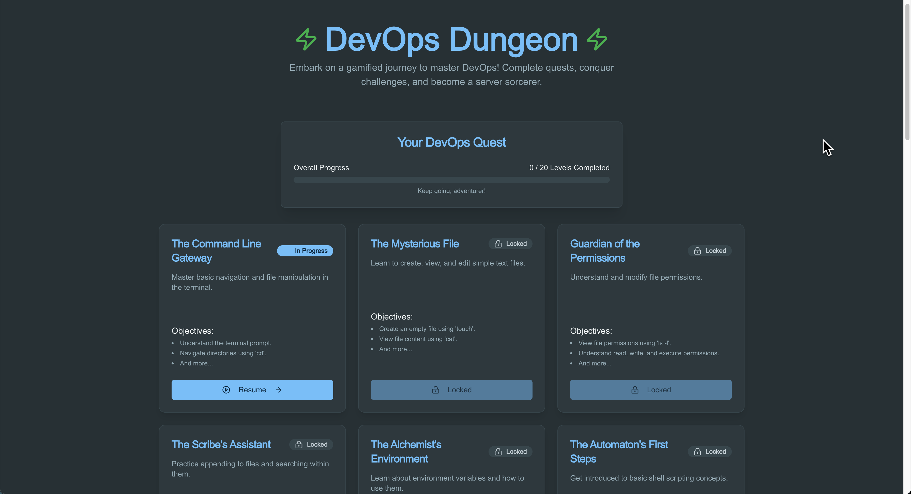

# Slide 5: DevOps Dungeon - Level-Based Learning System - Complete Implementation

## 🎯 Overview
Successfully transformed Slide 5 into a comprehensive demonstration of DevOps Dungeon as a serious hands-on laboratory learning environment, featuring level-based progression, AI-powered infrastructure, and Docker-based technical implementation.

## 📋 **Content Structure - IMPLEMENTED**

### **1. Title Section**
- **Title:** "DevOps Dungeon - Level-Based Learning System"
- **Professional positioning** as a serious learning platform
- **Clear focus** on hands-on laboratory approach

### **2. Platform Overview**
- **Visual Integration:** DevOps Dungeon screenshot (`devops-dungeon.png`) prominently displayed
- **Platform Description:** Serious hands-on laboratory learning environment
- **Level-Based Focus:** Comprehensive DevOps skill development through progression
- **Screenshot Overlay:** "Live Platform Interface" indicator

### **3. Interactive Learning Navigation**
- **3-Aspect System:** Horizontal timeline with clickable learning aspects
- **Progress Indicator:** Animated progress bar
- **Aspect Markers:** Themed icons (Flask, Brain, Docker) with aspect numbers
- **Keyboard Navigation:** Up/Down arrow keys for aspect navigation

## 🎮 **Interactive Learning Aspects - COMPLETED**

### **Aspect 1: Learning Methodology**
**Content Focus:**
- **Real Server Environments:** Actual server configurations and production-like scenarios
- **Task-Based Challenges:** Specific objectives for level progression
- **Submit-and-Validate System:** Automated verification for advancement
- **Progressive Difficulty:** Scaling from beginner to advanced concepts

**Level Progression System:**
- **Levels 1-3 (Beginner):** Basic concepts & tools - Green theme
- **Levels 4-7 (Intermediate):** Integration & automation - Orange theme  
- **Levels 8-12 (Advanced):** Complex architectures - Red theme
- **Levels 13+ (Expert):** Production scenarios - Purple theme

**Visual Elements:**
- **4x4 Grid Layout:** Server, Tasks, Validation, Progress icons
- **Color-Coded Levels:** Visual progression indicators
- **Interactive Cards:** Hover effects with detailed explanations

### **Aspect 2: AI-Powered Infrastructure**
**Core Features:**
- **No External Server Setup:** Zero infrastructure management required
- **Automated Environment Provisioning:** Dynamic isolated learning environments
- **Secure Isolated Environments:** Complete container isolation per learner
- **AI-Driven Challenge Generation:** Intelligent creation, validation, and feedback

**AI Automation Workflow:**
```
Challenge Request → Environment Provision → Task Execution → Auto Validation → Environment Cleanup
```

**Visual Implementation:**
- **4x4 Feature Grid:** Magic, Cogs, Shield, Robot icons
- **Workflow Visualization:** 5-step process with arrows
- **Interactive Elements:** Hover effects and smooth transitions

### **Aspect 3: Technical Implementation**
**Container Architecture:**
- **User Interface Layer:** Web Dashboard, Progress Tracking, Challenge Interface
- **AI Management Layer:** Container Orchestration, Challenge Generator, Validation Engine
- **Container Runtime Layer:** Docker Engine, Isolated Environments, Resource Management

**Technical Features:**
- **Docker Manager Integration:** Custom container orchestration platform
- **Dynamic Provisioning:** Real-time Docker container management
- **Scalable Infrastructure:** Auto-scaling without manual server management

**Architecture Visualization:**
- **3-Layer Diagram:** Stacked architecture representation
- **Component Cards:** Color-coded system components
- **Technical Details:** Docker, sync, and scaling icons

## 🎨 **Visual Design Features**

### **Layout Design:**
- **Scrollable Content:** Handles content exceeding viewport height
- **Professional Styling:** Blue/orange AI/QA color scheme with Docker blue accents
- **Responsive Design:** Desktop, tablet, and mobile optimized
- **Screenshot Integration:** Prominent DevOps Dungeon interface display

### **Interactive Elements:**
- **Click-Based Interactions:** No hover dependencies for mobile compatibility
- **Smooth Animations:** 0.4s ease-out transitions throughout
- **Visual Feedback:** Scale animations and color changes on interaction
- **Progress Indicators:** Animated learning aspect progression

### **Content Sections:**
- **Platform Overview:** Screenshot with overlay and description
- **Learning Aspects:** Horizontal timeline with markers
- **Expandable Details:** Progressive disclosure of detailed information
- **Architecture Diagrams:** Visual system representation

## ⌨️ **Keyboard Navigation - IMPLEMENTED**

### **Slide 5 Specific Controls:**
- **↑ (Up Arrow)** - Previous learning aspect
- **↓ (Down Arrow)** - Next learning aspect  
- **Esc** - Close active learning aspect
- **Click** - Direct aspect selection
- **Tab** - Navigate through interactive elements

### **Global Navigation:**
- **← →** - Previous/Next slide (disabled Up/Down on Slide 5)
- **Space** - Next slide
- **Home/End** - First/Last slide

## 📱 **Responsive Design Implementation**

### **Desktop (>1024px):**
- Full horizontal learning aspect layout
- Complete architecture diagrams
- Optimal screenshot display
- Full feature grid layouts

### **Tablet (769px-1024px):**
- Maintained aspect structure
- Adjusted spacing and sizing
- Touch-optimized interactions
- Readable content scaling

### **Mobile (<768px):**
- **Stacked Layout:** Learning aspects as vertical cards
- **Single Column:** All grids converted to single column
- **Vertical Workflow:** Rotated arrows for mobile flow
- **Simplified Architecture:** Stacked layer components

## 🔧 **Technical Implementation**

### **HTML Structure:**
```html
<div class="devops-dungeon-slide">
  <div class="platform-overview">
    <div class="platform-screenshot">
      
    </div>
  </div>
  <div class="learning-navigation">
    <div class="learning-progress">
      <!-- Animated progress bar -->
    </div>
    <div class="learning-aspects-container">
      <!-- 3 clickable learning aspects -->
    </div>
  </div>
  <div class="learning-details-panel">
    <!-- Expandable content for each aspect -->
  </div>
</div>
```

### **CSS Features:**
- **Grid & Flexbox:** Modern responsive layout techniques
- **CSS Transitions:** Smooth state changes and animations
- **Custom Properties:** Consistent theming and color management
- **Media Queries:** Comprehensive responsive breakpoints
- **Animation Keyframes:** Staggered entrance effects

### **JavaScript Functionality:**
- **Aspect Navigation:** Click and keyboard handlers
- **State Management:** Single active aspect tracking
- **Animation Coordination:** Staggered entrance effects
- **Keyboard Integration:** Up/Down arrow navigation
- **Screenshot Integration:** Responsive image handling

## ✨ **User Experience Enhancements**

### **Interaction Flow:**
1. **Platform Overview:** Screenshot and description introduction
2. **Aspect Selection:** Click or keyboard navigation
3. **Content Exploration:** Detailed information panels
4. **Architecture Understanding:** Visual system comprehension
5. **Technical Appreciation:** Implementation details

### **Visual Feedback:**
- **Hover States:** Subtle lift and shadow effects
- **Active States:** Accent color highlighting and scaling
- **Click Feedback:** Scale animations and state changes
- **Progress Indication:** Animated timeline fill

### **Accessibility Features:**
- **Keyboard Navigation:** Full keyboard support
- **Screen Reader Support:** Proper ARIA labels and semantic HTML
- **Focus Management:** Clear focus indicators
- **Semantic Structure:** Proper heading hierarchy

## 🎯 **Educational Value**

### **Learning Outcomes:**
1. **DevOps Understanding:** Comprehensive hands-on approach
2. **Level-Based Learning:** Progressive skill development
3. **AI Infrastructure:** Modern automated learning environments
4. **Docker Technology:** Container-based architecture understanding
5. **Technical Implementation:** Real-world system design

### **Practical Applications:**
- **Hands-On Labs:** Real server environment experience
- **Progressive Learning:** Structured skill development
- **AI Automation:** Understanding of modern learning platforms
- **Container Technology:** Docker-based system architecture
- **Scalable Design:** Infrastructure without manual management

## 🚀 **Interactive Features Summary**

### **Click Interactions:**
- **3 Learning Aspects:** Expandable content panels
- **Screenshot Display:** Platform interface showcase
- **Multiple Grids:** Methodology, AI features, technical details
- **Architecture Layers:** Visual system components

### **Keyboard Navigation:**
- **Up/Down Navigation:** Between learning aspects
- **Escape Functionality:** Close active content
- **Tab Navigation:** Through all interactive elements
- **Enter/Space Activation:** Alternative to clicking

### **Visual Animations:**
- **Staggered Entrance:** Aspects appear with delays
- **Progress Animation:** Timeline fills over 2 seconds
- **Hover Effects:** Lift and shadow animations
- **Transition Smoothness:** 0.4s ease-out for all changes

## 📊 **Content Metrics**

### **Information Density:**
- **3 Main Learning Aspects:** Comprehensive coverage
- **4 Methodology Components:** Detailed explanations
- **4 AI Infrastructure Features:** Technical capabilities
- **3-Layer Architecture:** System design visualization
- **4 Level Categories:** Progressive difficulty structure

### **Engagement Elements:**
- **1 Platform Screenshot:** Visual platform demonstration
- **3 Expandable Sections:** Progressive disclosure
- **Multiple Visual Indicators:** Progress and status
- **Keyboard Shortcuts:** Power user features

## ✅ **Implementation Status**

### **Completed Features:**
✅ **Comprehensive Content Structure**  
✅ **Interactive Learning Navigation**  
✅ **Keyboard Navigation (↑↓ keys)**  
✅ **Click-Based Interactions**  
✅ **Responsive Design**  
✅ **DevOps Dungeon Screenshot Integration**  
✅ **Professional Visual Design**  
✅ **Accessibility Support**  
✅ **Smooth Animations**  
✅ **Technical Architecture Visualization**  

### **Key Differentiators:**
- **Serious Learning Focus:** Positioned as professional development platform
- **Level-Based Progression:** Clear skill development structure
- **AI-Powered Infrastructure:** Modern automated learning environment
- **Docker Integration:** Real-world container technology
- **Hands-On Laboratory:** Practical, experiential learning approach

### **Ready for Presentation:**
The slide now provides a comprehensive, interactive demonstration of DevOps Dungeon as a serious level-based learning system, complete with technical implementation details, AI-powered infrastructure, and engaging user interactions.

**Access the updated presentation at:** `http://localhost:8000` and navigate to Slide 5 to experience the complete DevOps Dungeon learning system demonstration.
